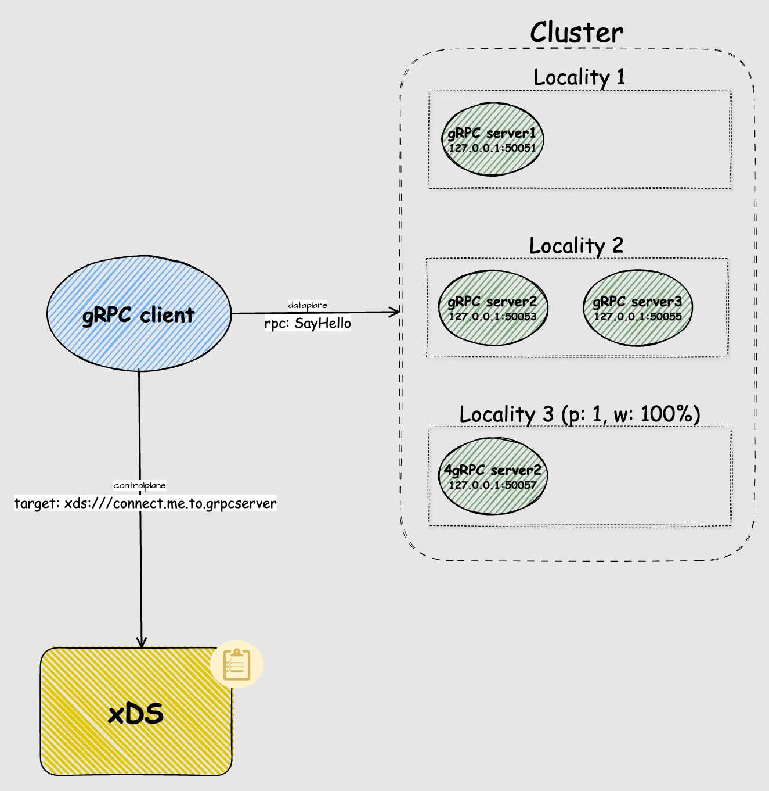
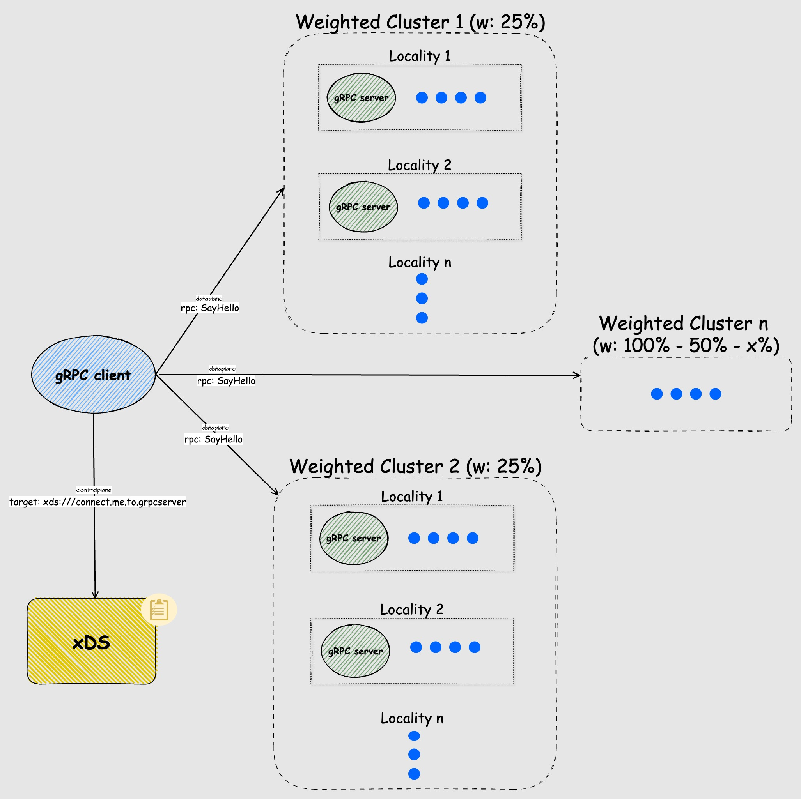
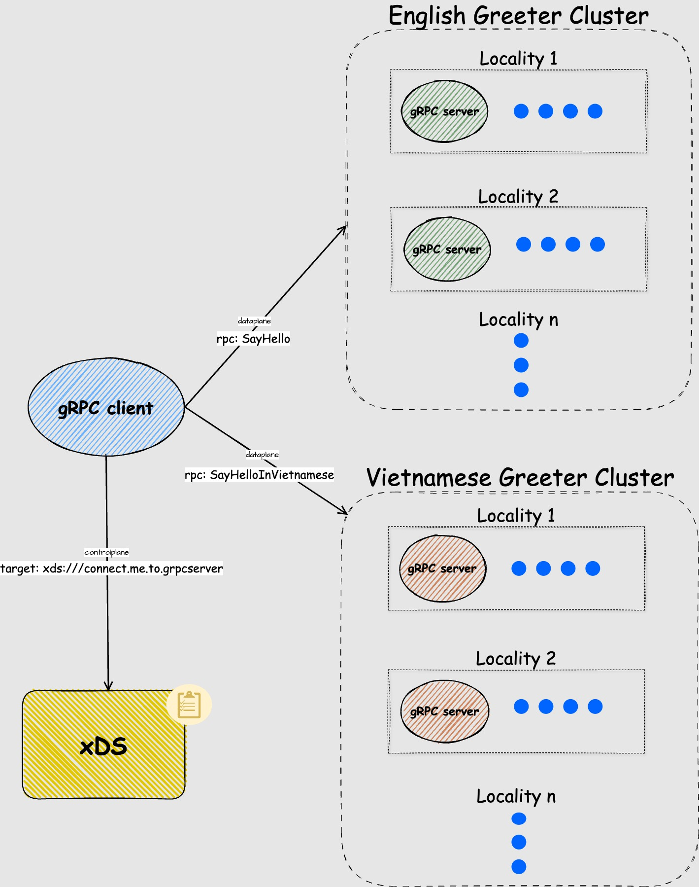

## Overview
RDS or RouteConfigurations is the 2nd layer or config Discovery Requests that is linked and referenced by [LDS](/cmd/greet/xds/LEARNING_README/LDS_README/Client_LDS_README.md).  
It also references clusters [CDS](/cmd/greet/xds/LEARNING_README/CDS_README/Client_CDS_README.md) either through different route paths (grpc full method name) or with different cluster weights.  

[RDS RFC](https://github.com/grpc/proposal/blob/master/A27-xds-global-load-balancing.md#rds)  

### Grpc Client specific RDS with single cluster
```go
func makeClientRoute() *route.RouteConfiguration {
	return &route.RouteConfiguration{
		Name: "local_route",
		VirtualHosts: []*route.VirtualHost{{
			Name:    "VH",
			Domains: []string{"*"},
			Routes: []*route.Route{{
				Name: "http-router",
				Match: &route.RouteMatch{
                    // all match
					PathSpecifier: &route.RouteMatch_Prefix{
						Prefix: "/",
					},
				},
                // Each route requires an action
				Action: &route.Route_Route{
					Route: &route.RouteAction{
						ClusterSpecifier: &route.RouteAction_Cluster{
							Cluster: "Cluster",
						},
					},
				},
			}},
		}},
	}
}
```
.  

### client specific RDS weighted multi cluster routing
```go
func makeClientRoute() *route.RouteConfiguration {
	return &route.RouteConfiguration{
		Name: RouteName,
		VirtualHosts: []*route.VirtualHost{{
			Name:    "VH",
			Domains: []string{"*"},
			Routes: []*route.Route{{
				Name: "http-router",
				Match: &route.RouteMatch{
                    // all match
					PathSpecifier: &route.RoutePrefix{
						Prefix: "/",
					},
				},
                // With Weighted Cluster
				Action: &route.Route_Route{
					Route: &route.RouteAction{
    					ClusterSpecifier: &route.RouteAction_WeightedClusters{
        					WeightedClusters: &route.WeightedCluster{
            					Clusters: []*route.WeightedCluster_ClusterWeight{
                					{
                    					Name:   "WeightedCluster1",
                    					Weight: &wrapperspb.UInt32Value{Value: 25},
                					},
                					{
                    					Name:   "WeightedCLuster2",
                    					Weight: &wrapperspb.UInt32Value{Value: 25},
                					},
									// ...
            				},
        				},
    				},
					}
				},
			},
		},
		}},
	}
}
```
.  

### RDS multi cluster routing
```go
func makeClientRoute() *route.RouteConfiguration {
	return &route.RouteConfiguration{
		Name: "local_route",
		VirtualHosts: []*route.VirtualHost{{
			Name:    "VH",
			Domains: []string{"*"},
			Routes: []*route.Route{{
				Name: "http-router",
				Match: &route.RouteMatch{
					PathSpecifier: &route.RouteMatch_Path{
						Path: "/greeter.Greeter/SayHello",  // full name path of grpc service proto, /package.grpcservice/rpc
					},
				},
				Action: &route.Route_Route{
					Route: &route.RouteAction{
						ClusterSpecifier: &route.RouteAction_Cluster{
							Cluster: "EnglishCluster",
						},
					},
				},
			},
			{
				Name: "http-router",
				Match: &route.RouteMatch{
					PathSpecifier: &route.RouteMatch_Path{
						Path: "/greeter.Greeter/SayHelloInVietnamese", // full name path of grpc service proto
					},
				},
				Action: &route.Route_Route{
					Route: &route.RouteAction{
						ClusterSpecifier: &route.RouteAction_Cluster{
							Cluster: "VietnameseCluster",
						},
					},
				},
			},
		},
		}},
	}
}
```
.  
  
Because there are multiple clusters which might have multiple endpoints distinct to those clusters we'll need to add them into their respective resource list
```go
func GenerateSnapshotClientSnapshot() *cache.Snapshot {
	snap, _ := cache.NewSnapshot(version,
		map[resource.Type][]types.Resource{
			resource.ClusterType:  {makeClusterA(), makeClusterB()}, // 2 resources
			resource.EndpointType: {makeEndpointA(), makeEndpointB()}, // 2 resources
			resource.RouteType:    {makeClientRoute()},
			resource.ListenerType: {makeClientListener()},
		},
	)
	return snap
}
```
