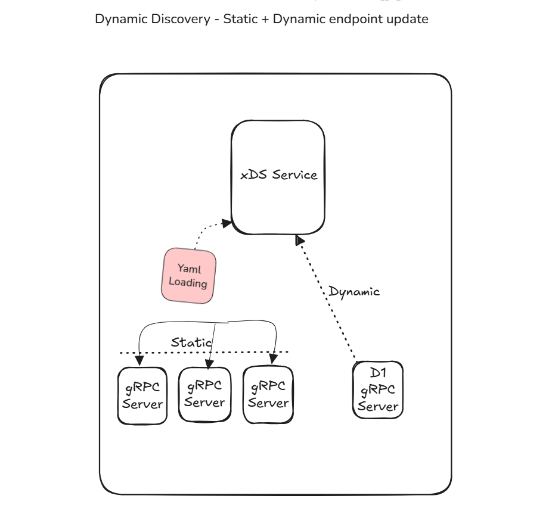
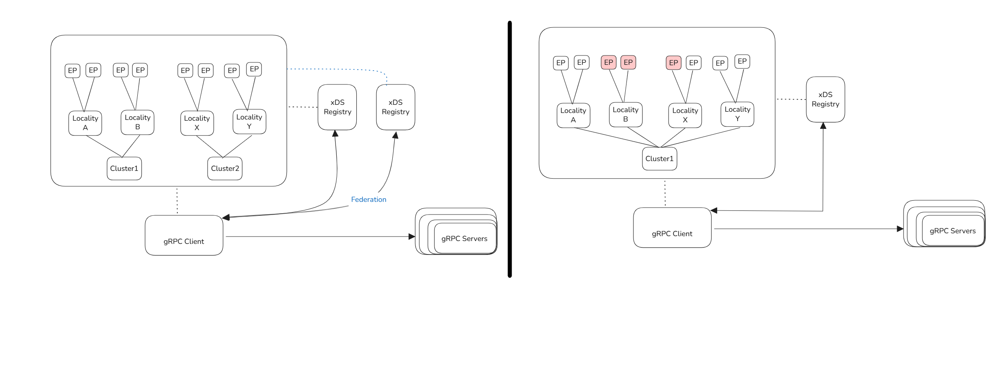
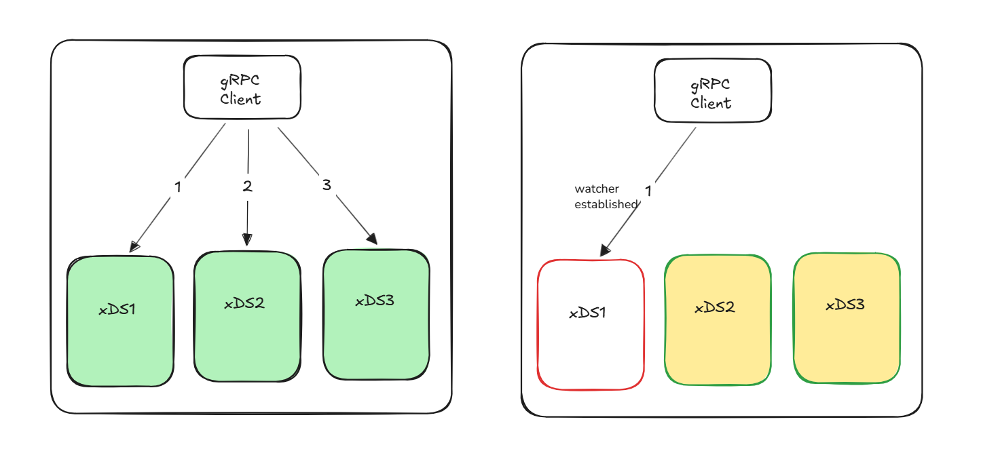
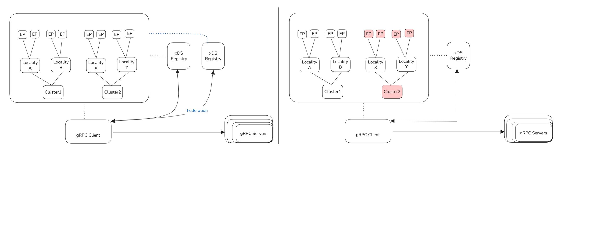

# XDS Control Plane


### Dynamic discovery (works anywhere)
#### Use requests from gRPC server to identify (new) and register. 
```sh
URL type: type.googleapis.com/envoy.config.listener.v3.Listener
Resource name: grpc/server?xds.resource.listening_address=11.222.333.444:5555"
```



### xDS Fallback
#### xxCan configure multiple xDS services.

### xDS Federation
    - slice & dice, load distribution and isolation. 



### Lesson
##### xDS Fallback
###### 1. Can configure multiple xDS services.
###### 2. Single point of failure?  yes, after Watcher is established at client side. 


#### Multi-cluster
##### 1. Isolation (Federation)
##### 2. Distribution of load
##### 3. Upstream/End-point Failure recognition 
##### 4. (Avoidance of bad clusters)

